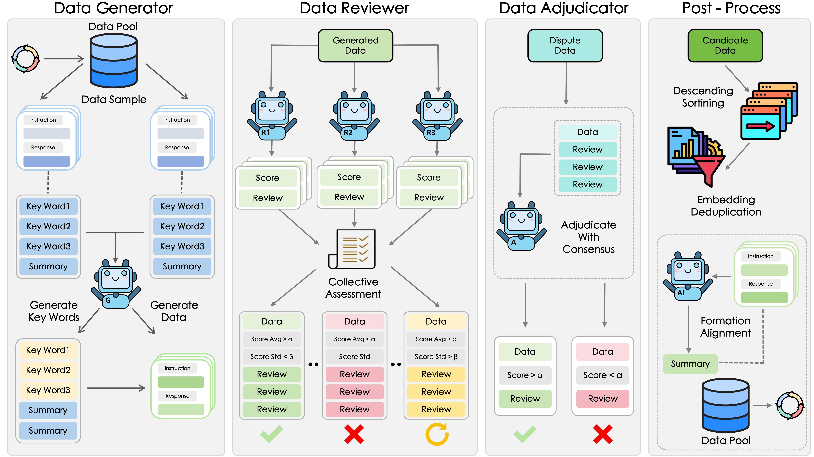
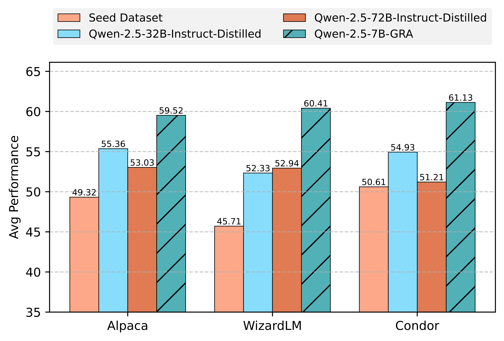
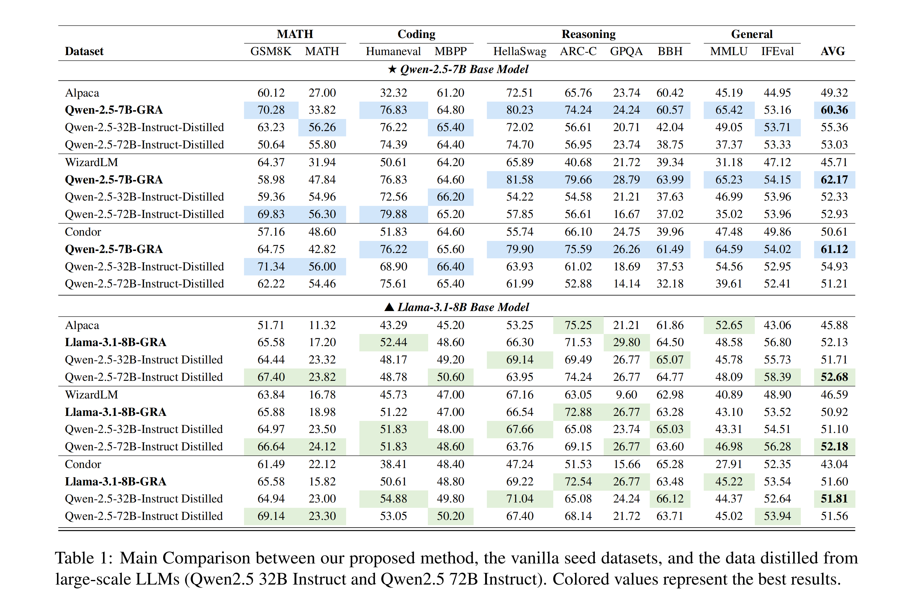

<p align="center">
<h1 align="center">David's Slingshot: A Strategic Coordination Framework of Small LLMs Matches Large LLMs in Data Synthesis</h1>

<p align="center">
    <a href="https://arxiv.org/pdf/2504.12322"></a>
    <a href="https://github.com/GX-XinGao/GRA/LICENSE"></a>
    <a href="https://huggingface.co/collections/GX-XinGao/gra-6801cba58ceb0074566cdb4e"></a>
</p>
We propose GRA, a multiple small LLMs collaborative framework that aggregats specialized roles across small LLMs can mimic the iterative refinement and quality control typically achieved by a single large LLM, in which multiple small LLMs assume distinct roles—Generator, Reviewer, and Adjudicator to simulate a peer-review-inspired data synthesis pipeline:


1. **Generator**, which proposes candidate data samples.
2. **Reviewer**, which evaluates quality and diversity through iterative critiques.
3. **Adjudicator**, which resolves conflicts to finalize outputs.



Through experiments across multiple benchmarks, we demonstrate that GRA-produced data matches or exceeds the quality of single large LLM outputs, e.g., Qwen-2.5-72B-Instruct. Our results challenge the necessity of monolithic large models for high-quality data synthesis, advocating instead for strategic coordination of smaller agents. 




We release the all the GRA generated datasets and six fine-tuned model.

| Dataset/Model | HuggingFace🤗 |
| - | :-: |
| GRA | [link](https://huggingface.co/datasets/GX-XinGao/GRA) |
| GRA-Refine | [link](https://huggingface.co/datasets/GX-XinGao/GRA-Refine) |
| Qwen-2.5-7B-GRA-Alpaca | [link](https://huggingface.co/GX-XinGao/Qwen-2.5-7B-GRA-Alpaca) |
| Qwen-2.5-7B-GRA-WizardLM | [link](https://huggingface.co/GX-XinGao/Qwen-2.5-7B-GRA-WizardLM) |
| Qwen-2.5-7B-GRA-Condor | [link](https://huggingface.co/GX-XinGao/Qwen-2.5-7B-GRA-Condor)|
| Llama-3.1-8B-GRA-Alpaca | [link](https://huggingface.co/GX-XinGao/Llama-3.1-8B-GRA-Alpaca)|
| Llama-3.1-8B-GRA-WizardLM | [link](https://huggingface.co/GX-XinGao/Llama-3.1-8B-GRA-WizardLM) |
| Llama-3.1-8B-GRA-Condor | [link](https://huggingface.co/GX-XinGao/Llama-3.1-8B-GRA-Condor) |

## 🎯 Quick Start
Install the dependencies:

```bash
conda create -n GRA python=3.10
conda activate GRA
git clone https://github.com/GX-XinGao/GRA.git
cd GRA
pip install -r requirements.txt

# Install LLaMA-Factory
cd ~/
git clone https://github.com/hiyouga/LLaMA-Factory.git
cd LLaMA-Factory
pip install -e ".[torch,metrics]"

# Install packages for evaluation
cd ~/
git clone  https://github.com/open-compass/opencompass opencompass
cd opencompass
pip install -e ".[vllm]"
```

## 📚 Data
Load the data from [GRA](https://huggingface.co/datasets/GX-XinGao/GRA), then convert each split to `.json` file and register the data information according to [LLaMA-Factory](https://github.com/hiyouga/LLaMA-Factory). 

## 🤖 Training
Our training codes depend on [LLaMA-Factory](https://github.com/hiyouga/LLaMA-Factory).
```bash
# Specify the dataset to be trained
export DATASET= GRA-Alpaca
# The path of base model
export MODEL_PATH=pretrained_model_path
bash train/train.sh
```

## 📊 Evaluation
Our evaluation codes depend on [opencompass](https://github.com/open-compass/opencompass).
You need to first download the model from HuggingFace, or SFT the model on your own. Then run the following evaluation script:
```bash
export MODEL_NAME=your_sft_llama_model_path
bash llama_test.sh

export MODEL_NAME=your_sft_qwen_model_path
bash qwen_test.sh
```

## 🙏 Acknowledgements
Many thanks to
* [LLaMA-Factory](https://github.com/hiyouga/LLaMA-Factory/tree/main)
* [opencompass](https://github.com/open-compass/opencompass/tree/main)

## Citation
If you find our code, model, or data are useful, please kindly cite our [paper](https://arxiv.org/abs/2503.xxxxxx):
```
@article{xxxxxx,
 title={David's Slingshot: A Strategic Coordination Framework of Small LLMs Matches Large LLMs in Data Synthesis}, 
 author={xxx and xxx and xxx and xxx and xxx and xxx and xxx and xxx and xxx},
 journal={arXiv preprint arXiv:2503.xxxxxx},
 year={2025}
}
```


